Write ups from the challenge that I solved alongside with collaboration of my team `HiB` in Qualifications of Techcomfest 2026. Qualifying to the final stage and this is my team score when it ended :

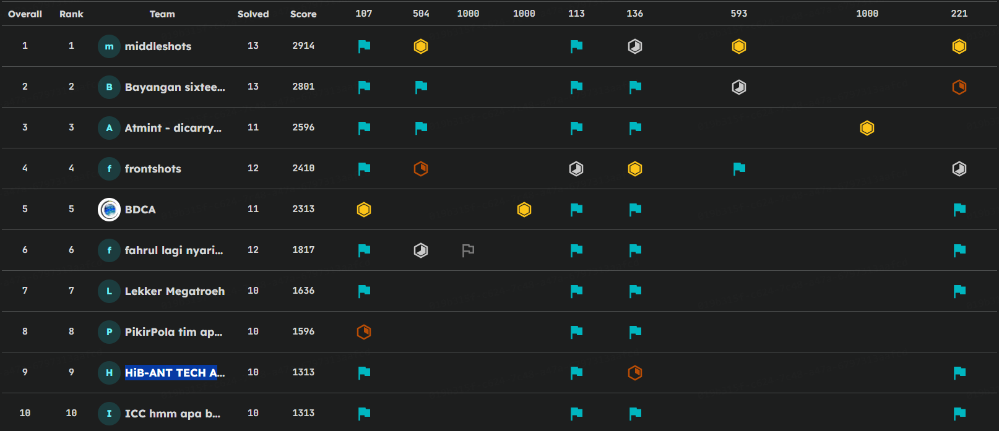

## Forensic
### pemanasan
#### Description
"Cisco Packet Tracer adalah perangkat lunak simulasi jaringan gratis dari Cisco Systems yang memungkinkan pengguna membuat, mengonfigurasi, dan menguji topologi jaringan virtual secara interaktif, berguna untuk belajar konsep jaringan, persiapan sertifikasi (seperti CCNA), serta simulasi skenario jaringan kompleks tanpa perlu perangkat keras fisik yang mahal. Alat ini menyediakan visualisasi pergerakan data dan antarmuka drag-and-drop untuk membangun jaringan dengan router, switch, PC, server, dan perangkat lain, menjadikannya media pembelajaran praktis yang populer di kalangan pelajar dan profesional IT."
#### Solution
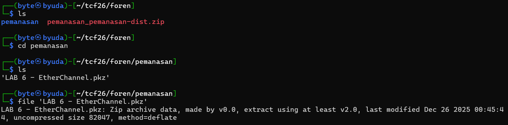
Given an zip file after we extracted it, there is a pkz file which is same as zip archive. So we extracted it again.
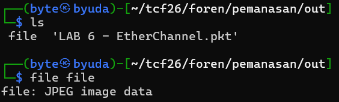
The output is `file` and `LAB 6 - EtherChannel.pkt`. The LAB 6 file is a Cisco Packet Tracer file and the `file` is detected by file command as jpeg.

Checked it out with xxd, it turned out `file` had a PNG like header, but missing the file signature.

So we fixed it, by adding PNG signature and the result is a QR Code. Scanned it and we got the flag.
#### Flag
TCF{75444f2ce78cda7dcc9d9af2cc935ae00fd3ed410a781832000e0ba4a3783948}

### mosquito
#### Description

#### Solution
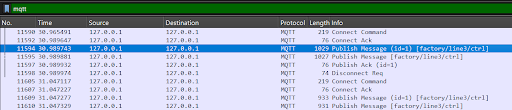
Given a pcap file that capture mostly tcp traffics. First recon I inspect the protocol hierarchy and there is `mqtt protocol`, a protocol that commonly `used in IoT device`.

I inspect one of TCP stream at the MQTT packets and I got some `broker creds` (username and password) and some `broker data payload`.
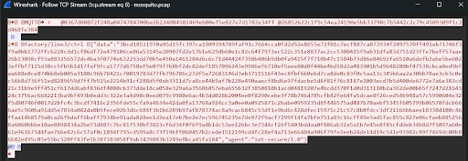
The data payload is served a topic `factory/line3/ctrl` that carries a hex string.

From TCP stream also found a `ELF binary` that writtens in GO. I extract this, and ask GPT to anlyze it. The binary turns out is an `AES-CBC encryptor` with PKCS#7 padding and key from the broker creds. `Key` was taken from first `16 byte of SHA256(username)` and `IV` was taken from first `16 byte of SHA256(f"{password}:{ts}")` with ts is the timestamp that was been used in the program (1761148328). For the decryption the ciphertext I assumed was the data payload of the broker topic, so we can make the decryptor like this:
```py
import hashlib
import re
from Crypto.Cipher import AES
from Crypto.Util.Padding import unpad

USERNAME = "0367d08072f248a0474784700be2b224084581469eb00ef5e827e7d1782e34ff"
PASSWORD = "26852622c1f9c54ea24190e5bb33790c7b5442c2c79c4509309f1c2d468fe384"

TS = 1761148328


CIPHERTEXT_HEX_LIST = [
    "3bcd18511970a95d15fc397ca1909394789faf91c7664cca0fd2d52e8655e72f01c7ecf887ca873934f2497570ff491eb71746f3f9a0bb1772ffcb228cdd1cf86df72e479106ce06a53145e20907fd2e17b1e629db60e1c82c64f7973ec522c351e8837ac2cc5300415f9ab31dfa83d751d23ffe7beff57aae26b13098cf93a883256572dc4ba3f0774e632293dd70b5e450a1461284d6c6c71d444247398b406b9db0fa9415f7f710b47c1584b73d86e84692fa6510a6defb2abe5be6023effbf7125d30cc5fb5b1d17faf9fca1777d6758ef5e079f768bf2dc82def1857096243e9986ef6710ef5eee80d0f44be4bd58d2a483901b5d9648280bf47538cbca0ed9bfaa688e0ce874bb8eb005a3180c96b78421c70019783d77fb796786c27df5a72683146d3eb3711516f43ec8fbf6b0ebd7ca8de0c83f0c5aa13c345b6aa2a30bb78ae3cb3c0ec56b8d736f51ed8289659d7ff7b515e2214b91cf288d5f0ab3311d7ca8ce44b9af7b228e490aaecf8bd6e97fdacbe5d8f81f76c8187e2003ecd7b5d400de6772e7a6e383cd21c31b9e9ff451cf617dd6abf836df4080cb373dde18ca058e329a6a35686857eba655b32f3850810b1acd04819207e4bcdd370f1d0d313110b2a362de00bb5f7247d2164324c3756ac6682213ba9bf493b0edd3c322e3a4d90c0eed079c9980e6ac4b3dd028b2004ee0f8290cebe3f78b746d785cfb42fe64fa5dcae8f26ced54b948a57c5990604e32f5d80746f0017d2bfc4c3bcdf7416c2356fde55cfa9a4634e42da0fa13768a924cc3a0ee0a0925871c2babe0959235d8f446575ad487b70aebf5345f605799b06578fdcb666ae5c960ba91dd5e7814a082da0b5fece02b3d6c684f3b1b6289b97af878374ac8a9cacb845c53df1e9bd6c428dfec15971c21c57c8b0fdcc3df21166bbaee18330d100c46ffaa14b8579a0ca26fbdaff6baff7934be91ada828ee1d2ea17eb7be2e7ec596745235e7de972f9acf7299f14fa7bfe751a83c16cff49e3ad1fac855c827e06cfaeb8852568a6060bbbe10ae8898434a2be73d887c7bc817530bf3823cf6d34f0f6f9a4b1dc53ee12bbc3e7344cf26f5403bddaa0f886ab32a5a1b7e45e8f45cfddeb34b8d7f1097a60e61e961b73d4fae766e82c6c57af0c1894f795cd599a8c73f19bff060457b2cede1512199cd4fc28ef4a713e66404a906f79fe2eeb24de14d19c541e91982c89f7469dc00b86b82e495c03e55bc520ff43fe5b387383058f9ab3439883b3249e8bca45fa184",
    "cec0d8015c94c6fb9dafda727994e2c7e600e5591d57a2d1498c443b6a88acfe5fe727e77de62cd609ae7f00a23f6b0e670761838505e4973f30cbbcb1e9a45d7293ef7c1e0308067ee5d5ef5c76b66550d1873001cc3dfdc4e1f0e3cbc3e97d38f834feb27bcf1a5e2af20d38b170bfef92555b407204fe3426302b3c14db6caaf716836b54b32aeb76937ccfcb8ec9037a9f8a1481f4e4962d7938fe673d3a962cd616299b70a489c7e1860c61fbc8ab3d2cd8b56944836472d98d0055399a5b1e5ef67b7775566cf7b6a1470ffcae7fd6851e853035ffb767d759b6746d5f4318e544afe0d1e76aec20571170350ac3786d5413ba7f15440859764c04055fd673813953fb62815206e704e9ad0862533c8aa82c8f074ee162942c896a58b4429b66e600097f4cab01c99b8bdb675fc0d4dc62825d779d433a3221a40498dc641d5d5f1256460be7b5afee031c9e19c611425b72d794a2984429c3fbc4248c39b077bd799ce4a3cd1d7c3e5f7673161ec932004b117826d6c0815a4d1aed9e7a8ff6438c918d77dfa3f53ebbe60980359e53e182881de7b84f1584ba7a01edb54a5fca083fc1d16da1c75d4f33b5a8e0bee2c644527b35d891614771a97c69a3b7214f3f896c61abc5861e40ad29c47e17e4d121104df9c6c345d4fb4a67bb21a39a0275fc8bc912beea63738bbf263a50bd7cf46c43ef629f640e5c0bda884751490e783069cd369dfa6152662515",
]

def derive_key_iv(username: str, password: str, ts: int) -> tuple[bytes, bytes]:
    key = hashlib.sha256(username.encode()).digest()[:16]  # AES-128
    iv  = hashlib.sha256(f"{password}:{ts}".encode()).digest()[:16]
    return key, iv

def decrypt_hex(hex_ct: str, key: bytes, iv: bytes) -> bytes:
    ct = bytes.fromhex(hex_ct.strip())
    pt = AES.new(key, AES.MODE_CBC, iv).decrypt(ct)
    return unpad(pt, 16)

def main():
    key, iv = derive_key_iv(USERNAME, PASSWORD, TS)

    all_plain = []
    for idx, hx in enumerate(CIPHERTEXT_HEX_LIST, 1):
        pt = decrypt_hex(hx, key, iv)
        text = pt.decode("utf-8", "replace")
        print(f"--- plaintext #{idx} ---")
        print(text)
        all_plain.append(pt)

    blob = b"\n".join(all_plain)
    m = re.search(rb"\{[^}]{5,200}\}", blob)
    if m:
        print("\n[+] Flag candidate:")
        print(m.group(0).decode("utf-8", "replace"))

if __name__ == "__main__":
    main()
```
#### Flag
TCF{00efcad114_kata_masfir_bosen_ransomware_00efdd8bcd}

### minami
#### Description
my image is full of logic, my wife is full of love but its kinda broken, help me
#### Solution
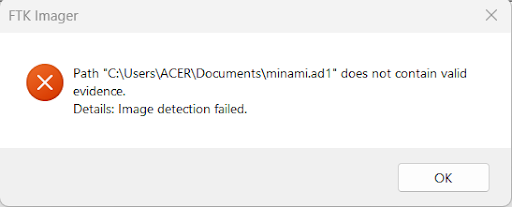
Given a .ad1 file, so without hestation I loaded it to the FTK Imager. It turned out that the `image is broken`.
```py
import argparse
import os
import re
import sys
import zlib
from pathlib import Path
from dissect.evidence.ad1 import AD1, EntryType

def safe_name(name: str) -> str:
    name = name.replace("\\", "_").replace("/", "_").strip()
    name = "".join(ch if ch.isprintable() and ch not in "\0" else "_" for ch in name)
    if not name:
        return "_"
    return name

def node_name_bytes_to_str(n: bytes) -> str:
    try:
        return n.decode("utf-8", errors="replace")
    except Exception:
        return repr(n)

def try_decompress(blob: bytes) -> bytes:
    if not blob:
        return b""
    magic = blob[:8]
    if magic.startswith(b"%PDF") or magic.startswith(b"\x89PNG") or magic.startswith(b"\xFF\xD8\xFF"):
        return blob
    if magic.startswith(b"PK\x03\x04") or magic.startswith(b"7z\xBC\xAF\x27\x1C") or magic.startswith(b"Rar!\x1A\x07"):
        return blob

    candidates = [
        (blob, -15),      # raw deflate
        (blob[2:], -15),  # raw deflate, skip 2-byte prefix (kasus CTF sering)
        (blob, 15),       # zlib-wrapped
        (blob[2:], 15),   # zlib-wrapped, skip prefix
    ]

    for data, wbits in candidates:
        if not data:
            continue
        try:
            return zlib.decompress(data, wbits)
        except Exception:
            pass

    # return raw if fail
    return blob

def extract_file(fh, img: AD1, node) -> bytes:
    entry = node.entry
    chunks = list(entry.chunks)
    end = entry.meta

    base = img.logical_image_offset
    # boundary list: base + chunk_offsets + base + end
    bounds = [base + off for off in chunks] + [base + end]

    out_parts = []
    for s, e in zip(bounds[:-1], bounds[1:]):
        if e <= s:
            continue
        fh.seek(s)
        comp = fh.read(e - s)
        out_parts.append(try_decompress(comp))

    data = b"".join(out_parts)
    if getattr(node, "size", None) is not None and len(data) > node.size:
        data = data[: node.size]
    return data

def walk(node, parent_path: Path, out_dir: Path, pattern: re.Pattern | None, do_extract: bool, printed: set):
    name = node_name_bytes_to_str(node.name)
    name_fs = safe_name(name)
    cur_rel = parent_path / name_fs

    if node.entry.type == EntryType.Directory:
        if str(cur_rel) not in printed:
            print(f"[DIR ] {cur_rel}")
            printed.add(str(cur_rel))
        if do_extract:
            (out_dir / cur_rel).mkdir(parents=True, exist_ok=True)
        for ch in getattr(node, "children", []):
            walk(ch, cur_rel, out_dir, pattern, do_extract, printed)

    elif node.entry.type == EntryType.File:
        if pattern and not pattern.search(str(cur_rel)):
            return
        size = getattr(node, "size", None)
        sz = f"{size} bytes" if size is not None else "unknown size"
        print(f"[FILE] {cur_rel} ({sz})")

        if do_extract:
            out_path = out_dir / cur_rel
            out_path.parent.mkdir(parents=True, exist_ok=True)
            data = extract_file(WALK_FH, WALK_IMG, node)
            out_path.write_bytes(data)

    else:
        print(f"[OTHR] {cur_rel} (type={node.entry.type})")

def main():
    ap = argparse.ArgumentParser(description="Generic AD1 extractor (CTF-friendly).")
    ap.add_argument("input", help="Path to .ad1 file")
    ap.add_argument("-o", "--out", default="ad1_out", help="Output directory (default: ad1_out)")
    ap.add_argument("--pattern", help="Regex filter for relative path (extract only matching)")
    ap.add_argument("--list", action="store_true", help="Only list entries, do not extract")
    args = ap.parse_args()

    in_path = Path(args.input)
    out_dir = Path(args.out)
    out_dir.mkdir(parents=True, exist_ok=True)

    pat = re.compile(args.pattern) if args.pattern else None
    do_extract = not args.list

    global WALK_FH, WALK_IMG
    printed = set()

    with in_path.open("rb") as fh:
        img = AD1(fh)
        WALK_FH = fh
        WALK_IMG = img


        for child in img.root.children:
            walk(child, Path(), out_dir, pat, do_extract, printed)


    if do_extract:
        print(f"\n[+] Done. Extracted to: {out_dir.resolve()}")

if __name__ == "__main__":
    main()
```
Because the image was broken, I made a script that can `parse the AD1 file structure` with `dissect.evidence` library. From the parsing, I found out that there is only a pdf file in the image.
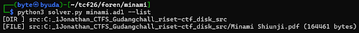
GPT said, that file `saved as several compressed chunks`, `every chunk` needs to deflated as `raw deflate` and there is `2 byte prefix` at the `start` of the chunk that should be `skipped before decompressing`. All of the `decompressed chunk got combined`, then `cutted` according to the actual file size.

After the pdf got extracted, we got the flag.
#### Flag
TCF{fix_the_disk_please?_00efbcdd8b}

## Web
### http3 0day
#### Description
This was an easy challenge isn't?, you don't even need the source code to solve it. Here's the binary instead. Good luck! but it doesnt matter anyway because it is 10/10 same.
#### Solution
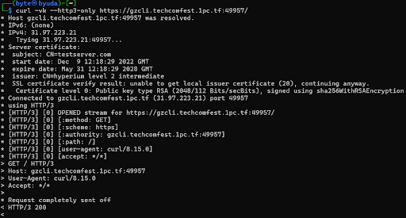
The first step I took was to ensure the service was actually accessible using HTTP/3. Initially, I tried using the regular http scheme, but that failed to connect. After `forcing HTTPS` and ensuring there were no fallback protocols with `--http3-only`, the QUIC/HTTP/3 `connection` was `successful`.
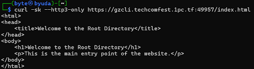
From there, the `/ endpoint` responding with an HTTP/3 `200` response, but the `body is empty`. Interestingly, when I access `/index.html`, the server returns the HTML `"Welcome to the Root Directory."` This maybe suggests a path traversal vulnerability.
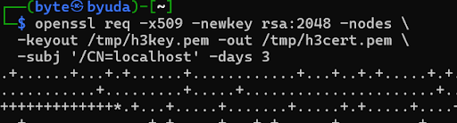
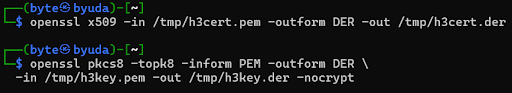
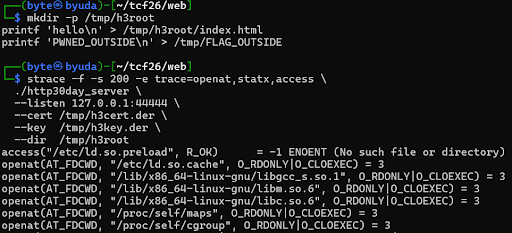
Since the binary was provided, I `created a local reproduction` to see what the server was actually doing. The binary I received was called http30day_server and had options like --dir, --cert, --key, and --listen. I ran the local server with a custom root directory and intentionally placed one file outside the root to test if there was a way to read absolute files.
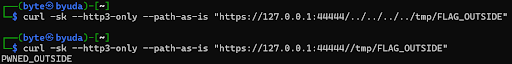
Interestingly, traversing `../` resulted of `no effects`, but a request with a path prefixed with a `double slash (https://URL//[path_traversal])` actually caused `path traversal` and open an absolute path in the filesystem`.

The next exploit is reading the /etc/passwd file in the remote server to make sure the exploit is succeed there.
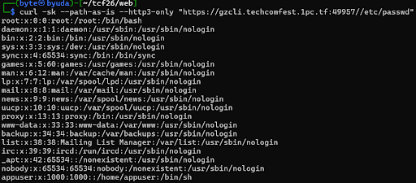
Since this was a `container`, I utilized `/proc`. From `/proc/self/mounts`, I could see the `mount points` and identify the `files added to the container`. Here, there was one mount that was sus: `/how_you_did_get_h3r3_br00h.txt`.
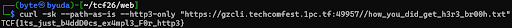
And the file immediately contains the flag.
#### Flag
TCF{1ts_just_b4ddD0cs_ex4mpl3_F0r_http3}