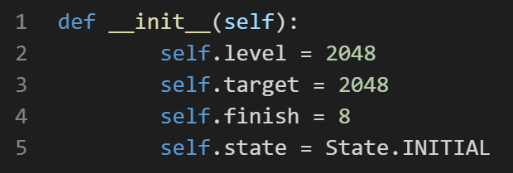
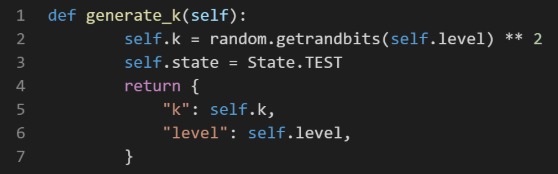
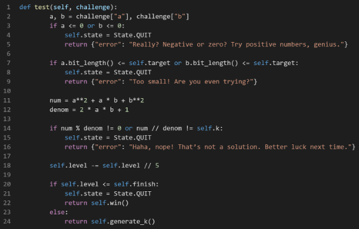

Complete write-ups of challenges solved in Teknocomp 2025 CTF held by Teknokrat University. I finished 2nd on the leaderboard, and here is my final score:


## Web
### Betting
#### Description
Don’t worry, bro, no one can hack this!

http://38.47.176.164:4112/

#### Solution

The website simulates a slot machine. Upon inspecting the URL, I noticed a `?slot` parameter that represents the slot number after spinning. By modifying this parameter to display all 5s, I was able to retrieve the flag.


#### Flag
Tekncom{G4mbl1ng_L0se_M0n3y_4ll_Day_L0l}

### Anti Royalti
#### Description
The government recently imposed strict music royalty rules, but honestly, they don’t really enforce them. Listening to music online is basically free, and this website claims you can enjoy songs without triggering any royalties. Your task is to investigate if it actually works and find the hidden flag.

http://38.47.176.164:4111/

#### Solution

I tested the website's input handling by injecting a Server-Side Template Injection (SSTI) payload `{{7*7}}`. The payload executed successfully, confirming the vulnerability. I then escalated the attack to execute remote code using the payload:

`{{ self.__init__.__globals__.__builtins__.__import__('os').popen('id').read() }}`


#### Flag
Teknocom{L1st3n1ng_t0_Mus1c_1s_Fr33_Dud3_G0v_D03s_N0th1ng_4nym0r3}

## Forensic
### phake
#### Description
"Something valuable is hidden. Will you discover it?"

#### Solution

Analyzing the provided pcap file revealed HTTP packets. By inspecting the HTTP stream, I found the flag in packet 90.


#### Flag
Teknocom{y0u_4ctu4lly_f0und_1t_lol}

### Vault
#### Description
Wielino has left his mark among thousands of sarcastic messages. Only the patient and observant will uncover his secret
#### Solution

Using basic steganographic analysis tools (exif, strings, binwalk, etc.), I discovered a gzip file embedded in the image. Extracting the gzip file revealed a binary folder. By running `grep -R "Teknocom" bin`, I located the flag.


#### Flag
Teknocom{b1nw4lk_3xtr4ct3d_1t_lol}

### Traceee
#### Description
The mission to reconstruct fragmented evidence from digital chaos, meticulously building a clear and undeniable narrative of an incident that will stand up to the highest levels of scrutiny.
#### Solution
The pcapng file contained only TCP packets. By analyzing the packets, I identified a sequence of packets containing PNG data. Using a custom Python script, I reconstructed the PNG image and retrieved the flag.

```python
import sys, struct

PNG_SIG = b"\x89PNG\r\n\x1a\n"

def parse_pcapng_packets(buf: bytes):
    packets = []
    i = 0
    endian = "<"
    while i + 12 <= len(buf):
        block_type = struct.unpack_from(endian + "I", buf, i)[0]
        if i == 0 and block_type != 0x0A0D0D0A:
            block_type_be = struct.unpack_from(">I", buf, i)[0]
            if block_type_be == 0x0A0D0D0A:
                endian = ">"
                block_type = block_type_be
        if i + 8 > len(buf):
            break
        block_total_length = struct.unpack_from(endian + "I", buf, i + 4)[0]
        if block_total_length < 12 or i + block_total_length > len(buf):
            break
        body = buf[i + 8: i + block_total_length - 4]


        if block_type == 0x0A0D0D0A:
            if len(body) >= 4:
                bom = struct.unpack_from(endian + "I", body, 0)[0]
                if bom == 0x1A2B3C4D:
                    endian = "<"
                elif bom == 0x4D3C2B1A:
                    endian = ">"
        elif block_type == 0x00000006:  # EPB
            if len(body) >= 20:
                caplen = struct.unpack_from(endian + "I", body, 12)[0]
                pkt = body[20:20+caplen]
                if len(pkt) == caplen:
                    packets.append(pkt)
        elif block_type == 0x00000003:  # SPB
            if len(body) >= 4:
                caplen = len(body) - 4
                pkt = body[4:4+caplen]
                packets.append(pkt)
        i += block_total_length
    return packets


def extract_tcp_payloads(frames):
    payloads = []
    for data in frames:
        if len(data) < 14:
            continue
        eth_type = struct.unpack_from("!H", data, 12)[0]
        off = 14
        if eth_type in (0x8100, 0x88A8):
            if len(data) < 18:
                continue
            eth_type = struct.unpack_from("!H", data, 16)[0]
            off = 18
        if eth_type == 0x0800 and len(data) >= off + 20:  # IPv4
            ver_ihl = data[off]
            ihl = (ver_ihl & 0x0F) * 4
            proto = data[off + 9]
            l4 = off + ihl
            if proto == 6 and len(data) >= l4 + 20:  # TCP
                doff = (data[l4 + 12] >> 4) * 4
                pl = l4 + doff
                payloads.append(data[pl:])
        elif eth_type == 0x86DD and len(data) >= off + 40:  # IPv6
            nh = data[off + 6]
            l4 = off + 40
            if nh == 6 and len(data) >= l4 + 20:  # TCP
                doff = (data[l4 + 12] >> 4) * 4
                pl = l4 + doff
                payloads.append(data[pl:])
    return payloads


def main():
    pcap_path = "chall.pcapng"
    out_path = "reconstructed.png"


    with open(pcap_path, "rb") as f:
        buf = f.read()
    frames = parse_pcapng_packets(buf)
    tcp_payloads = extract_tcp_payloads(frames)


    start_idx, end_idx = 2, 24
    parts = []
    for i in range(start_idx, end_idx + 1):
        pl = tcp_payloads[i-1]
        if not pl.startswith(b"USBI"):
            continue
        data_len = struct.unpack(">I", pl[8:12])[0]
        parts.append(pl[12:12+data_len])


    stream = b"".join(parts)
    if not stream.startswith(PNG_SIG):
        raise RuntimeError("Rebuilt stream does not start with PNG signature")


    with open(out_path, "wb") as f:
        f.write(stream)
    print(f"[+] Wrote {out_path} ({len(stream)} bytes)")


if __name__ == "__main__":
    main()
```

#### Flag
Teknocom{rly_you_thought_this_was_easy}

## Reverse
### Reversify
#### Description
This program asks you to enter the flag. Beware there are multiple fake flags that might trick you. The correct flag is carefully split into several parts inside the binary, and only by combining them correctly will you get the real flag.
#### Solution

First step is by scanning all of ASCII string using izz. There will be a some of flag, and the right one is the flag that has been splitted. With some easy logic I can reconstructed the actual flag.
#### Flag
Teknocom{kn0w_th3_bin4ry_fi1e_with_s0m3_str1ng}

### Ba1ted
#### Description
This program seems simple: enter the correct password, and you get the flag. But beware, it uses constructor functions that check the password before main() runs. The correct password is 24 characters long and checked in small parts. One wrong character, and the program exits immediately.
#### Solution

Opening the binary in Ghidra shows several functions marked with `__attribute__((constructor))` (or located in the .init_array section). Each one performs a small check: it takes `2 bytes` from `argv[1]`, calls `strncmp(actual, expected, 2)`, and then calls `exit(1)` if the comparison fails. These checks are chained in sequence until all 24 characters have been verified. The program relies on standard functions like `strncmp` to validate the input `before main()` runs, but it doesn’t account for linker interposition. On Linux ELF binaries that are dynamically linked, we can load our own shared library before libc using LD_PRELOAD, causing the program’s `strncmp calls` to resolve to our implementation instead of the real one.

Inside that hook, we can log the parameters being compared, especially the second argument (s2), which is the expected (correct) 2-byte chunk of the password. In other words, we don’t need to brute-force the password: the program effectively "leaks" it piece by piece every time it calls `strncmp`. The first approach is to hook strncmp via `LD_PRELOAD` using the following code:
```c
#define _GNU_SOURCE
#include <stdio.h>
#include <dlfcn.h>
#include <string.h>
#include <unistd.h>


typedef int (*orig_strncmp_f)(const char*, const char*, size_t);


int strncmp(const char* s1, const char* s2, size_t n){
    static orig_strncmp_f orig = NULL;
    if(!orig) orig = (orig_strncmp_f)dlsym(RTLD_NEXT, "strncmp");


    int res = orig(s1, s2, n);


    fprintf(stderr, "[strncmp] n=%zu s1='%.*s' s2='%.*s' -> %d\n",
            n, (int)n, s1, (int)n, s2, res);
    return res;
}
```

Next, we extract the password chunks step by step. The password is 24 characters long and is validated two characters at a time. The trick is to run the program using the correct prefix we’ve already recovered, plus some padding (for example, `A`) so the constructors keep progressing to the next check. On each run, we read the hook’s `stderr` output to see the `s2` value. 
Start from scratch:
`LD_PRELOAD=./hook.so ./main AAAAAAAAAAAAAAAAAAAAAAAA`
The hook will print something like:
`[strncmp] n=2 s1='AA' s2='c0' -> ...`
This means the first two characters should be `c0`. Run it again using the correct prefix plus padding:
`LD_PRELOAD=./hook.so ./main c0AAAAAAAAAAAAAAAAAAAAAA`
Repeat this process, increasing the prefix by two characters each time. Once all chunks have been revealed, concatenate them in order, the full sequence you observed is the flag.
#### Flag
Teknocom{c0ngr4ts_but_n0t_r34llyy}

### Overfit
#### Description
Seems like someone thought neural networks make things secure. Prove them wrong.
#### Solution

Opening the `.npz` file reveals five entries: `W1, b1, W2, b2, and y`. All of them are `float64`. Their shapes are:
- W1: (57, 57), b1: (57,)
- W2: (57, 57), b2: (57,)
- y: (57,), with values strictly in (0, 1)
The fact that everything has dimension `57` strongly suggests that the input length, hidden layer size, and output length are all the same, matching the length of a string (the flag). The output vector `y` being entirely within `(0, 1)` is also highly consistent with a `sigmoid` activation.

Based on the naming convention and value ranges, this looks like a `two-layer MLP (multi-layer perceptron)` with sigmoid activations on both layers:
- Hidden layer: h = sigmoid(W1 · x + b1)
- Output layer: y = sigmoid(W2 · h + b2)
If that’s correct, we can reverse the computation:
- Apply the inverse of sigmoid (the logit function) to undo the last activation:
- z2 = logit(y) = W2 · h + b2, then solve for h.
Undo the first layer the same way:
- z1 = logit(h) = W1 · x + b1, then solve for x.

Finally, interpret `x` as normalized ASCII values (i.e., ascii / 127). That means `round(x * 127)` recovers the original bytes, which can then be converted into the flag string. The core weakness here is using a neural network as “data obfuscation.” Once we have the weights and biases—and we know the activation function—the entire pipeline becomes a sequence of invertible steps: sigmoid can be reversed with logit, and the linear transformations can be reversed using standard linear algebra. Below is a solver that:

1. Loads W1, b1, W2, b2, and y from Overfit.npz
2. Reverses the sigmoid with logit
3. Solves the linear systems to recover h and then x
4. Converts x into ASCII using round(x * 127) and reconstructs the flag
```python
import numpy as np
import sys


def logit(p):
    eps = 1e-12
    p = np.clip(p, eps, 1 - eps)
    return np.log(p / (1 - p))


def lin_solve(A, b):
    try:
        return np.linalg.solve(A, b)
    except np.linalg.LinAlgError:
        return np.linalg.pinv(A) @ b


def recover_flag(npz_path="Overfit.npz"):
    data = np.load(npz_path, allow_pickle=True)
    W1, b1 = data["W1"], data["b1"]
    W2, b2 = data["W2"], data["b2"]
    y      = data["y"]


    # Asumsi model:
    #   h = sigmoid(W1 x + b1)
    #   y = sigmoid(W2 h + b2)
    # Balik berurutan dengan logit -> linear solve
    z2 = logit(y)
    h  = lin_solve(W2, z2 - b2)     # hasil idealnya di (0,1)
    z1 = logit(h)
    x  = lin_solve(W1, z1 - b1)     # hasil idealnya di [0,1]


    x = np.clip(x, 0, 1)
    ascii_vals = np.rint(x * 127).astype(int)
    ascii_vals = np.clip(ascii_vals, 0, 127)
    flag = ''.join(map(chr, ascii_vals))


    return flag.strip()


if __name__ == "__main__":
    path = sys.argv[1] if len(sys.argv) > 1 else "Overfit.npz"
    print(recover_flag(path))
```
#### Flag
Teknocom{L00k_M0m_1_Tr41n3d_A_N3ural_N3tw0rk_F0r_4_Fl4g}

## Cryptography
### ARX
#### Description
Someone thought 64 bytes of confusion would keep the secret safe… good luck reversing their ‘brilliant’ ARX stream cipher
#### Solution

The challenge provides an implementation of a simple keystream generator called `baby_arx`. The initial `key is 64 bytes` long and is filled with the FLAG, truncated or `padded` to exactly `64 bytes`. If the FLAG is shorter than 64 bytes, it is padded with the character '0' (0x30).
At each step, the generator only looks at the first two bytes of the internal state, `state[0]` and `state[1]`. It produces one output byte b, then shifts the state. More precisely, the generator defines:
- f1(b) = b ^ ((b << 1) | (b & 1)) (mod 256)
- f2(b) = b ^ ROL3(b) (mod 256), where ROL3 is a 3-bit left rotation
- b = (f1(state[0]) + f2(state[1])) (mod 256)
- state = state[1:] + [b]

Each output byte depends only on two state bytes. The step function `f1` is also not bijective (each output has two possible inputs), and the keystream byte `b` is fed back into the state (it becomes the newest state byte). Combined with the predictable `'0'` padding at the end of the 64-byte key, this creates a local relation that can be reversed.

The idea is to start from the last known relation (from K[63]), derive candidates for x[63], and then backtrack from index 62 → 0 using a preimage table for f1. Whenever f1 yields two possible predecessors, we choose the one that looks plausible for a flag (printable ASCII, and characters commonly used in flags such as letters/digits, {}, _, -, etc.). After reconstructing the full 64-byte initial state (FLAG + padding), we strip the padding by cutting the recovered string at the first } to obtain the actual flag.

With that approach, the solver looks like this:
```python
import sys
from typing import List

def f1(b: int) -> int:
    # b ^ ((b << 1) | (b & 1))
    return (b ^ (((b << 1) | (b & 1)) & 0xff)) & 0xff


def rol3(b: int) -> int:
    return ((b << 3) & 0xff) | (b >> 5)


def f2(b: int) -> int:
    # b ^ ROL3(b)
    return (b ^ rol3(b)) & 0xff


pre_f1 = {y: [] for y in range(256)}
pre_f2 = {y: [] for y in range(256)}
for x in range(256):
    pre_f1[f1(x)].append(x)
    pre_f2[f2(x)].append(x)


ALLOWED = set(range(48,58)) | set(range(65,91)) | set(range(97,123)) | {95,123,125,45,33,46,58}


def recover_key(keystream: bytes) -> List[bytes]:
    K = list(keystream)
    # K[63] = f1(x63) + f2(K[0]) (mod 256)
    target = (K[63] - f2(K[0])) % 256
    cand_x63 = pre_f1[target]


    solutions = []
    for x63 in cand_x63:
        x = [None]*64
        x[63] = x63
        stack = [(62, x)]
        while stack:
            i, cur = stack.pop()
            if i < 0:
                solutions.append(bytes(cur))
                continue
            need = (K[i] - f2(cur[i+1])) % 256    # need = f1(x[i])
            cands = pre_f1[need]
            prioritized = [c for c in cands if c in ALLOWED] or cands
            for c in prioritized:
                nxt = cur.copy()
                nxt[i] = c
                stack.append((i-1, nxt))
    return solutions


def main():
    hex_str = open('output.txt', 'r').read().strip()


    try:
        ks = bytes.fromhex(hex_str)
    except ValueError:
        print("Input harus berupa hex 64 byte", file=sys.stderr)
        sys.exit(1)
    if len(ks) != 64:
        print(f"Expect 64 byte, dapat {len(ks)}", file=sys.stderr)
        sys.exit(1)


    sols = recover_key(ks)
    if not sols:
        print("Tidak ada solusi ditemukan")
        return


    for i, key in enumerate(sols):
        preview = ''.join(chr(c) if 32 <= c <= 126 else '.' for c in key)
        print(f"[{i}] Key 64B (preview): {preview}")
        flag = key[:key.index(125)+1] if 125 in key else key.rstrip(b'0')
        try:
            print("FLAG:", flag.decode('ascii'))
        except UnicodeDecodeError:
            print("FLAG (bytes):", flag)
        print()


if __name__ == "__main__":
    main()
```
#### Flag
Teknocom{B4byARX_St34m_C1ph3r_K33ps_T3kn0c0m_Fl4g_X9Q2}

### King Caesar
#### Description
King Caesar has hidden a secret message in plain sight. Each word of his message has been shifted using a repeating pattern of 3, 5, 2, 4, 1. Observe the pattern carefully and see what mysteries the king left behind.
#### Solution
In the provided output file, the title and the challenge description state that this is a Caesar cipher where each message is shifted using a repeating pattern: 3, 5, 2, 4, 1.

Using the Caesar Cipher tool at https://cryptii.com/pipes/caesar-cipher and trying those shift values (cycling through the pattern for each segment/message) reveals the flag.
#### Flag
Teknocom{Th1s_C4es4r_1s_4_J0k3_S1mpl3r_Th4n_Y0u}

### Pailliiered
#### Description
Try to break our hilarious Paillier, good luck!
nc 38.47.176.164 1006
#### Solution
From the source code, the program prints the modulus **n** without revealing **g**, provides one sample ciphertext **E(4)**, then asks for an integer that will be decrypted and compared against the target byte string **"Please give me the flag"**. This gives three important clues:
1. The scheme used is **Paillier**.
2. The message space is **Zₙ** (the decrypted value is reconstructed into bytes and matched).
3. We are given one valid encryption, namely **E(4)**.

With that information, we can model the service as a standard Paillier implementation, where encryption of a message **m** has the form:
$$
E(m) = g^m \cdot r^n \pmod{n^2}
$$
Relevant Paillier properties are:
$$
E(a)\cdot E(b) \equiv E(a+b), \quad E(a)^k \equiv E(k\cdot a) \pmod{n^2}
$$
Also, since **n** is the product of two odd primes, (\gcd(4,n)=1), so $$(4^{-1} \pmod n)$$ always exists.

This challenge intentionally hides **g** so that we supposedly “cannot” form encryptions of an arbitrary message **M**. However, Paillier is **malleable**: if we have one valid ciphertext **E(a)**, then raising it to the power **k** gives **E(k·a)** without knowing **g** or the randomness **r**. The program provides **E(4)**, so:
$$
E(4)^k \equiv E(4k) \pmod{n^2}
$$
Our target plaintext is:
$$
M = \text{bytes_to_long}(\text{"Please give me the flag"})
$$
If we choose:
$$
k \equiv M \cdot 4^{-1} \pmod n
$$
then:
$$
4k \equiv M \pmod n
$$
and because the message space is reduced modulo **n**, decrypting (E(4)^k) becomes exactly **M**. This is the core exploit: use the additive homomorphism to forge an encryption of the target message using only one example ciphertext (here **E(4)**). With that, the solver looks like:
```python
from pwn import remote
import re


TARGET = b"Please give me the flag"


def b2l(b: bytes) -> int:
    return int.from_bytes(b, "big")


def main():
    io = remote("38.47.176.164", 1006)


    data = io.recvuntil(b"E(4) = ")
    # Public key (n, g) = (<n>, ?)
    text = data.decode(errors="ignore")
    n_match = re.search(r"Public key \(n, g\) = \((\d+), \?\)", text)
    assert n_match, "gagal parse n"
    n = int(n_match.group(1))


    # E(4)
    c4_line = io.recvline().strip()
    c4 = int(c4_line)


    # k = M * inv(4) mod n
    M = b2l(TARGET)
    inv4 = pow(4, -1, n)
    k = (M * inv4) % n


    # C = E(4)^k mod n^2
    nsq = n * n
    C = pow(c4, k, nsq)


    # send ct
    io.sendline(str(C).encode())
    resp = io.recvall().decode(errors="ignore")
    print(resp)


if __name__ == "__main__":
    main()
```
#### Flag
Teknocom{Breaking_P41ll13r_Really_Was_A_Bad_Idea}

### Sqrt Madness
#### Description
Solve the impossible math madness… if you dare.
nc 38.47.176.164 2014
#### Solution

The server initializes three important parameters: `level = 2048`, `target = 2048`, and `finish = 8`. These values control the instance size and the minimum bit-length requirement for the answer.

In each round, the server generates a number `k` as a perfect square, `k = getrandbits(level) ** 2`, then sends JSON `{"k": k, "level": level}` to the user. Because `k` is always of the form `s²`, we can deterministically work with `s = sqrt(k)`.

When receiving our answer, the server rejects zero/negative values; ensures both `a` and `b` have bit length greater than `2048`; and checks the ratio:
$$
\frac{a^2 + ab + b^2}{2ab + 1} = k
$$
If this fails, the server stops; if it succeeds, `level` is reduced by `level // 5` (≈20%). When `level <= finish (8)`, the server sends the flag. Therefore, we must repeatedly send pairs `(a,b)` that satisfy the equation above for various `k` values, all of which are perfect squares, while keeping `bit_length(a) > 2048` and `bit_length(b) > 2048` in every round.

The first key is that `k` is always a perfect square, so we can safely set `s = sqrt(k)`. The second key is that there is an explicit family of solutions: take `(a,b) = (s, 2s^3 - s)`. With the seed `(s, 2s^3 - s)`, in the first round `a = s` has bit length ≈ `2048`, so it is not yet greater than 2048. To pass this gate, we use Vieta-jumping: if `(a,b)` is a solution, then the “other root” with respect to `a` or `b` is also an integer solution, with formulas `a' = (b^2 - s^2)/a` and `b' = (a^2 - s^2)/b`. With that, the solver looks like:
```python
from pwn import remote
import json, math, sys


HOST, PORT = "38.47.176.164", 2014
TARGET_BITS = 2048


def other_root_a(s, a, b):
    return (b*b - s*s) // a


def other_root_b(s, a, b):
    return (a*a - s*s) // b


def make_big_solution(s, target_bits=TARGET_BITS):
    # (a, b) = (s, 2 s^3 - s)
    a = s
    b = 2*s*s*s - s


    if s <= 1:
        return 1, 1


    for _ in range(600):
        if a.bit_length() > target_bits and b.bit_length() > target_bits:
            break
        a = other_root_a(s, a, b)
        if a.bit_length() > target_bits and b.bit_length() > target_bits:
            break
        b = other_root_b(s, a, b)
    return a, b


def solve_once(io):
    while True:
        line = io.recvline().decode(errors="ignore").strip()
        if line.startswith("{") and line.endswith("}"):
            data = json.loads(line)
            break


    while True:
        if "flag" in data:
            print(data["flag"])
            return True


        if "k" not in data:
            print("Unexpected:", data)
            return False


        k = int(data["k"])
        s = math.isqrt(k)
        if s*s != k:
            print("k bukan kuadrat sempurna — server logic tak sesuai asumsi.")
            return False


        a, b = make_big_solution(s, TARGET_BITS)


        payload = json.dumps({"a": int(a), "b": int(b)}).encode()
        io.sendline(payload)


        # read next response
        line = io.recvline().decode(errors="ignore").strip()
        while not (line.startswith("{") and line.endswith("}")):
            line = io.recvline().decode(errors="ignore").strip()
        data = json.loads(line)


        if "error" in data:
            print("Server error:", data["error"])
            return False


def main():
    io = remote(HOST, PORT, typ='tcp')
    ok = solve_once(io)
    io.close()
    if not ok:
        sys.exit(1)


if __name__ == "__main__":
    main()
```
#### Flag
Teknocom{Br4inTw1st3d_Sqrt_Ch4ll3nge}

### PrimeSum
#### Description
Classic RSA, but with a twist, instead of leaking one of the primes, we just give you their sum. Think you can factor it and recover the flag? Easy… if you like playing with big numbers.
#### Solution
```python
e = 0x10001
p = getPrime(1024)
q = getPrime(1024)
n = p * q
e = 65537
phi = (p-1)*(q-1)
d = pow(e,-1,phi)
hint = p + q
c = pow(m,e,n)
```
This challenge is pure classic RSA, with the modification that what is leaked is not one of the primes **p** or **q**, but their sum **S = p + q** (in the output called `hint`). `enc.py` shows the standard RSA key generation process: choose 1024-bit primes **p,q**, compute **n = pq** and **φ(n) = (p−1)(q−1)**, set **e = 65537**, compute **d ≡ e^(−1) (mod φ(n))**, then encrypt **c ≡ m^e mod n**. The code also prints `hint = p + q`. So, the artifacts we have are:
* **e** (public exponent),
* **d** (private exponent),
* `hint = S = p + q`,
* **c** (ciphertext).

Interestingly, the value **n** is not printed. That looks like an “anti-spoiler”—but it actually gives us an exploitation path: from (**e,d**) we know **ed−1** is a multiple of **φ(n)**, and from `hint` we know **p + q**. The combination of both is enough to reconstruct **n** and factor it. I wrote a Python solver that:
* Parses **e**, **d**, **S**, **c** from the output file.
* Computes **K = ed − 1**.
* Performs a small brute force for **k = 1..e** and filters only **k** that divide **K**.
* For each candidate, sets **φ = K / k** and **n = φ + S − 1**, then checks whether **D = S^2 − 4n** is a perfect square.
* When **D** is a perfect square, computes **p,q** and verifies **pq = n**. If it passes, decrypts **m = c^d mod n** and prints the flag.
```python
from math import isqrt


def parse_output(path="output.txt"):
    vals = {}
    with open(path, "r") as f:
        for line in f:
            if "=" not in line:
                continue
            k, v = line.strip().split("=", 1)
            v = v.strip().replace("_", "").replace(",", "")
            if "..." in v:
                raise ValueError("Angka terpotong (mengandung '...'). Gunakan angka utuh.")
            vals[k.strip()] = int(v)
    needed = ("e", "d", "hint", "c")
    if not all(k in vals for k in needed):
        raise ValueError(f"Key yang wajib ada: {needed}, dapat: {tuple(vals.keys())}")
    return vals["e"], vals["d"], vals["hint"], vals["c"]


def try_recover_factors(e, d, S):
    K = e * d - 1
    for k in range(1, e):
        if K % k:
            continue
        phi = K // k
        n = phi + S - 1
        D = S*S - 4*n
        if D < 0:
            continue
        r = isqrt(D)
        if r*r != D:
            continue
        p = (S + r) // 2
        q = (S - r) // 2
        if p*q != n:
            continue
        if (p-1)*(q-1) != phi:
            continue
        return n, p, q, phi
    return None, None, None, None


def solve(path="output.txt"):
    e, d, S, c = parse_output(path)
    n, p, q, phi = try_recover_factors(e, d, S)
    if not n:
        raise RuntimeError("Gagal memulihkan faktor. Pastikan nilai e,d,S (hint) valid dan utuh.")
    m = pow(c, d, n)
    m_bytes = m.to_bytes((n.bit_length()+7)//8, "big").lstrip(b"\x00")
    try:
        flag = m_bytes.decode()
    except UnicodeDecodeError:
        flag = repr(m_bytes)
   
    print(f"flag = {flag}")


if __name__ == "__main__":
    solve("output.txt")
```
#### Flag
Teknocom{Br1ng_Me_Th3_Pr1m3s_p_plus_q}

## PWN
### Lomgin
#### Description
This “top-notch” login system lets you pick a user… but surely nothing will happen if you aim for admin, right? Go ahead, I’m sure it’s perfectly safe.
nc 38.47.176.164 3042
#### Solution


Static analysis with Ghidra on `main()` shows that numeric input is read into a signed 32-bit variable, a simple bound check is performed such as `if (sel >= 7) { puts("No"); exit; }`, then the value is truncated down to 16-bit (e.g., `uint16_t idx = (uint16_t)sel;`). This 16-bit index is then used to access a username pointer table. Finally, if `strncmp(name, "admin", 5) == 0`, the program runs `system("/bin/sh")`.

In assembly, this pattern appears as a `movsx`/`mov` into a 32-bit register, then a `mov` into a 16-bit register (AX), and then a `movzx` when used as an index. There is a moment where a negative 32-bit value is truncated to 16-bit without preserving the sign, causing wraparound.

Dynamic experiments via `nc` further confirm the bug. Negative input passes the `sel < 7` check. But immediately after the cast to unsigned 16-bit, it becomes `(sel & 0xFFFF)`, which can land exactly on the admin index. So validation is done at signed 32-bit width, but the actual use is based on the truncated 16-bit unsigned result. The formula is to take:
$$
n = 7 - 65536 \cdot k, \quad k \ge 1
$$
With this, `n & 0xFFFF = 7`, while `n` itself is negative and therefore passes the `< 7` check. The smallest example is `n = 7 - 65536 = -65529`. Substituting:
* `(-65529 & 0xFFFF) == 7`
* the index falls to the `"admin"` entry.
With that, a solver can be constructed as follows:
```bash
printf -- "-65529\ncat flag; cat flag.txt; ls\n" | nc 38.47.176.164 3042
```
#### Flag
Teknocom{C4nt_R34ch_Adm1n_Haha}